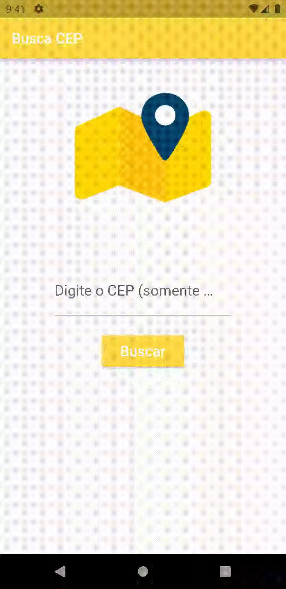

# Busca CEP
> App que consulta o endereço do CEP informado consumindo uma API.

Projeto para estudo do framework Flutter e da linguagem Dart.

Consome a API da viacep.com.br e retorna para o usuário o endereço do CEP informado.

Conteúdo estudado e implementado neste App: base scaffold, componentes de interface, componentes de entrada de dados, widgets statefull, atualização de estado e requisições de API/webservice.

## Screen Recording Android:

## Histórico de Atualizações:

* 20221109:
    * Versão inicial.

## Links:

[https://github.com/danielperesjr/busca-cep-flutter](https://github.com/danielperesjr/busca-cep-flutter)